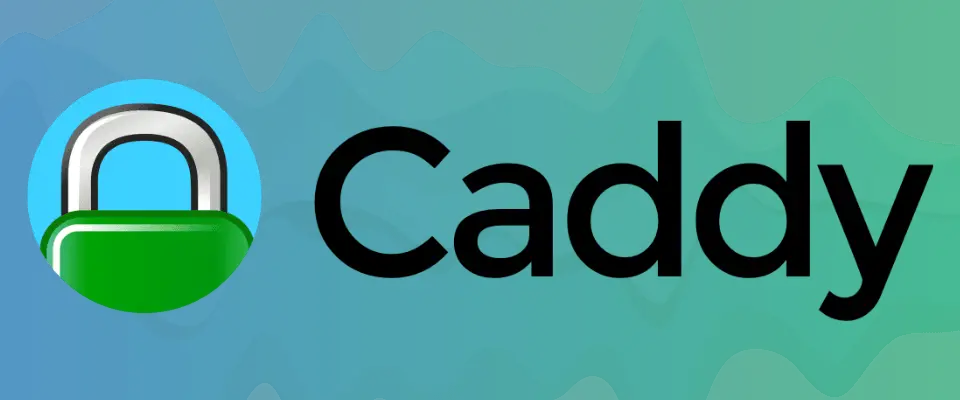

# n8n-docker-caddy




---

Este proyecto está basado en [n8n-io/n8n-docker-caddy](https://github.com/n8n-io/n8n-docker-caddy) y permite desplegar n8n junto a Caddy y Qdrant usando Docker Compose, con configuración modular.

## Contenido

- [Uso](#uso)
  - [Clonar el repositorio](#clonar-el-repositorio)
  - [Crear variables de entorno](#crear-variables-de-entorno)
  - [Crear el archivo Caddyfile](#crear-el-archivo-caddyfile)
  - [Levantar los servicios](#levantar-los-servicios)
  - [Verificar el estado de los servicios](#verificar-el-estado-de-los-servicios)
- [Notas adicionales](#notas-adicionales)

---

## Uso

### Clonar el repositorio

```sh
git clone git@github.com:jeastman19/n8n-docker-caddy.git
cd n8n-docker-caddy
```

### Crear variables de entorno

```sh
cp env.example .env
```

Editar el archivo `.env` y completar los valores necesarios.

### Crear el archivo Caddyfile

Para generar el archivo `config/caddy/Caddyfile`, asegurate de haber completado previamente las variables de entorno.

```sh
./config.sh
```

### Levantar los servicios

```sh
docker compose up -d
```

---

### Verificar el estado de los servicios

```sh
docker compose ps
docker logs -f n8n
```

Podés acceder a n8n desde:

```
https://<SUBDOMAIN>.<DOMAIN_NAME>
```

---

## Notas adicionales

- El sistema usa PostgreSQL como base de datos.
- Qdrant es utilizado como vector store para funcionalidades de recuperación aumentada (RAG).
- Se eliminó Redis del proyecto. En el futuro, se planea usar Valkey gestionado por DigitalOcean.
- Los archivos de configuración están organizados por parciales (`docker-partials/`) para facilitar el mantenimiento.

---