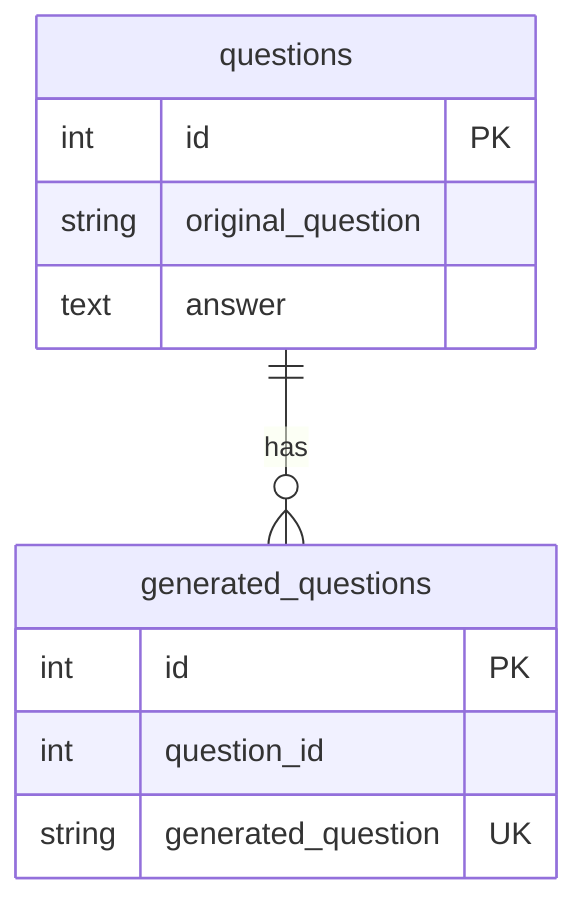

---


```sql
create database faqs;

CREATE TABLE questions (
    id SERIAL PRIMARY KEY,
    original_question VARCHAR(255) NOT NULL,
    answer TEXT NOT NULL
);

CREATE TABLE generated_questions (
    id SERIAL PRIMARY KEY,
    question_id INTEGER NOT NULL,
    generated_question VARCHAR(255) NOT NULL UNIQUE,
    
    CONSTRAINT fk_question
      FOREIGN KEY(question_id) 
      REFERENCES questions(id)
      ON DELETE CASCADE
);

CREATE INDEX idx_generated_questions_question_id ON generated_questions(question_id);

```
